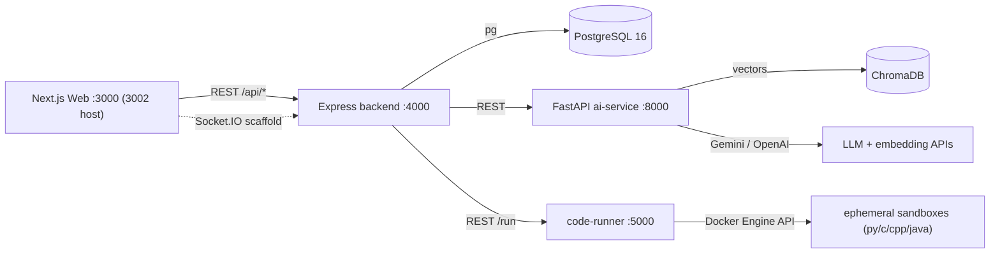

# InterviewForge - Interview Prep Notes

> Your complete, explain-out-loud study guide for the InterviewForge project.
> Read top to bottom once, then jump to whatever the interviewer drills into.
> Everything here is grounded in the actual code, with file paths so you can back up any claim.
>
> **Last synced with the repo: 2026-09-20** (after the UI/UX polish merge, PR #7).
> The companion record is [`DECISIONS.md`](DECISIONS.md) — every non-obvious call, D-001 to D-052.

---

## Table of Contents

1. [The pitch (30s / 2min)](#1-the-pitch)
2. [High-level architecture](#2-high-level-architecture)
3. [Tech stack and why](#3-tech-stack-and-why)
4. [Service-by-service deep dive](#4-service-by-service-deep-dive)
5. [The RAG pipeline (deep section)](#5-the-rag-pipeline-deep-section)
6. [Personal data isolation (resume-grounded interviews)](#6-personal-data-isolation)
7. [The problem catalogue and how it is verified](#7-the-problem-catalogue)
8. [End-to-end data flows](#8-end-to-end-data-flows)
9. [LLM orchestration, cost and limits](#9-llm-orchestration-cost-and-limits)
10. [Database schema](#10-database-schema)
11. [Testing, CI and the UI pass](#11-testing-ci-and-the-ui-pass)
12. [Deployment (and why there is no live link)](#12-deployment)
13. [What I'd do next](#13-what-id-do-next)
14. [One-line cheat sheet](#14-one-line-cheat-sheet)
15. [The five best stories](#15-the-five-best-stories)

---

## 1. The pitch

### 30-second version
"InterviewForge is an AI-powered mock interview platform. You pick a company - 10 of them, Amazon through Airbnb - and a difficulty, and it runs you through a full technical loop: behavioral, coding, system design, and core CS. The questions aren't just prompted from an LLM - they're grounded with **RAG** over a corpus of company-specific interview material, and I measured the retrieval quality rather than assuming it: **nDCG went from 0.771 to 0.901** against a hand-labelled golden set, at **6.6x lower p50 latency**. There's also a LeetCode-style engine with **150 problems, every one verified executable in four languages** inside hardened Docker sandboxes. It's a **microservice architecture** - Node/Express for orchestration and auth, Python/FastAPI for all the AI."

### 2-minute version (add this)
- **Why this architecture:** the Node backend contains zero AI logic - auth, sessions, orchestration, SQL. Everything ML/LLM/RAG lives in the Python FastAPI service, so each side uses the right ecosystem and can be reasoned about separately.
- **The RAG part is the differentiator, and it's measured.** I built a 42-query labelled evaluation harness *before* tuning anything, then tested five retrieval techniques against it and **reverted the two that lost**. That's the story most personal projects can't tell.
- **Safety:** user code never runs on the host - ephemeral containers, non-root, all capabilities dropped, no network, PID and CPU caps, removed in a `finally`. Each control was proven adversarially, before and after.
- **The most interesting bugs were found by reading code, not by outages** - a headline feature that was fully unit-tested and connected to nothing; a deletion path that resurrected the thing it had just deleted; an endpoint that had returned 500 for every user for five months.

---

## 2. High-level architecture

Six containerized services, one client (the Next.js web app).



### The services
| Service | Tech | Port | Responsibility |
|---|---|---|---|
| **web** | Next.js 16, React 19, TS, Tailwind 4 | 3000 (3002 host) | UI: Monaco editor, React Flow diagrams, Recharts, PDF export |
| **backend** | Express 5, TS | 4000 | Auth, sessions, orchestration, all SQL |
| **ai-service** | FastAPI, Python | 8000 (8010 host) | RAG, LLM chains, speech, code review, recommendations, resumes |
| **code-runner** | Node + dockerode | 5000 (5050 host) | Ephemeral Docker sandboxes for user code |
| **postgres** | PostgreSQL 16 | 5432 (5433 host) | All relational data |
| **chromadb** | Chroma 0.5.5 | 8000 (8001 host) | RAG vector store |

Host ports are offset because another project on this machine owns 3000/8000/5432 (D-024, D-031b, D-041). Services talk to each other over the compose network by hostname, so the offsets never affect service-to-service traffic - a point worth making if someone asks about environment parity.

### The key design rule (say this verbatim)
> "Node does orchestration and data. Python does AI. They talk over REST. The Node service has **zero** ML logic - if an answer needs to be evaluated or a question generated, Node makes an HTTP call to FastAPI."

**A native SwiftUI iOS client was built and then deleted** (D-007, still in history at `e24baf6`). Say why if it comes up: no realistic audience for it, and every change meant reopening Xcode to re-verify a second client. Cutting it was a scope decision, not a failure.

---

## 3. Tech stack and why

- **Next.js (App Router) + React 19 + Tailwind** - file-based routing, SSR-capable, fast to build a polished UI. Monaco for coding, React Flow for architecture diagrams, Recharts for analytics, jsPDF for client-side report export.
- **Express 5 + TypeScript** - lightweight orchestration layer; TS for type safety across the API surface.
- **FastAPI** - async Python, auto-generated OpenAPI, the natural home for LangChain/Chroma/provider SDKs.
- **LangChain** - prompt templates + output parsers + provider swapping, instead of hand-rolling every call. Used deliberately thinly: chains are `prompt | llm | parser`, no agents.
- **ChromaDB** - simple open-source vector store, runs as its own container over HTTP.
- **PostgreSQL** - raw SQL, 11 ordered migrations, no ORM. Strong constraints, JSONB where flexibility is genuinely needed.
- **Docker + Docker Compose** - six services, one command; the same images promoted to the production compose file.
- **Gemini 3.1 Flash Lite primary / GPT-4o-mini fallback** - both configurable. The model choice was settled by measurement, not preference (D-037, see section 9).

---

## 4. Service-by-service deep dive

### 4.1 Web (Next.js)
App Router under `web/src/app/`: dashboard, problems + problem detail, interview, system-design, assessments, learning paths, leaderboard, analytics, profile, auth flows, settings.

- **Monaco editor** for the coding workspace - theme-aware, doesn't steal focus on mount, respects `prefers-reduced-motion`.
- **React Flow** renders system-design diagrams from the AI's nodes/edges JSON, with a text equivalent listing components and connections for non-visual access.
- **PDF export** of the interview report is client-side (`web/src/lib/interviewPdf.ts`).
- **Recharts** analytics - solved-over-time, difficulty distribution, topic radar, all reachable without hover.
- **Socket.IO client** is wired but realtime is unused (emits a `hello`) - an honest gap, say it before they find it.
- **55 behavioural tests** (Vitest + Testing Library) covering hydration, resource states and workspace behaviour.

### 4.2 Express backend
Entry `backend/src/index.ts`. Middleware order: CORS (single origin, credentials) -> `express.json({ limit: "8mb" })` -> correlation ID -> **rate limiting** on `/api/*`.

Routes: `/api/auth`, `/api/users`, `/api/problems`, `/api/problem-bookmarks`, `/api/submissions`, `/api/interviews`, `/api/assessments`, `/api/leaderboard`, `/api/learning-paths`, `/api/recommendations`, `/api/resumes`.

**Auth:** JWT (HS256, 7-day, payload `{ userId }`), bcrypt at 10 rounds, `requireAuth` / `optionalAuth` middleware. Email verification and password reset issue real expiring tokens, but the emails are only `console.log`ed - no SMTP. Say this proactively.

**External calls** use native `fetch` (no axios). DB access goes through one `query()` helper over a `pg` Pool; route handlers hold the SQL directly - a deliberate thin architecture, and the first thing I'd refactor (section 13).

### 4.3 FastAPI ai-service
Entry `ai-service/app/main.py`. Routers: `rag`, `interview`, `speech`, `system_design`, `code_review`, `recommendations`, `resume`, plus `/health` and `/metrics/llm`.

All LLM calls go through LangChain chains in `app/llm/chains.py`, every one with `JsonOutputParser(pydantic_object=...)` so output is typed JSON rather than prose, and every one through `invoke_with_fallback` (section 9).

### 4.4 code-runner (the sandbox)
Node + Express talking to Docker via **dockerode**. One endpoint: `POST /run` with `{ language, code, testCases, slug }`.

Pipeline (`code-runner/src/runner.ts`):
1. Look up problem metadata by slug (method name, parameter types, return type, design-class shape).
2. Generate combined code = language harness + user code (`harness-gen.ts`). The harness parses inputs, calls the user's `Solution` method (or drives a design class method-by-method), and prints one output line per test case.
3. Pack the code file and `input.txt` into an **in-memory tar** and `putArchive` into the container - never a host temp file.
4. Create + start an ephemeral container; compile and execute as one `sh -c` with stdin redirected.
5. **15 s wall-clock timeout** via `Promise.race([container.wait(), timeout])`; on timeout, kill and return TLE for every case.
6. Demux Docker's multiplexed log stream, compare line by line (`compareOutputs`: exact, JSON-aware, float tolerance 1e-4, opt-in unordered comparison).
7. `finally`: `container.remove({ force: true })`.

**Hardening actually set** (D-032): `User: "runner"` (non-root), `CapDrop: ["ALL"]`, `SecurityOpt: ["no-new-privileges"]`, `NetworkDisabled: true`, `Memory`/`MemorySwap` capped, `PidsLimit`, `NanoCpus`, and a size-bounded exec tmpfs.

- **Proven adversarially, before and after:** writing `/etc/passwd` **succeeded** under the old config and is blocked under the new one; a fork bomb halts at **exactly 127 children**; the network is unreachable.
- **`ReadonlyRootfs` is deliberately excluded, and that's a decision.** Docker's archive API refuses to write into a read-only rootfs, so user code couldn't be injected at all. The alternatives don't earn their complexity when the container is already ephemeral, unprivileged and network-disabled, and the tmpfs is what bounds disk use.
- **A trap found the hard way:** Docker mounts tmpfs `noexec` by default. C and C++ compiled fine and then failed at run time with `Permission denied` - a change that looks like a hardening win right up until half the languages stop working.
- **`memoryKb` is sampled during execution** (D-033), not exact: cgroup v2 exposes no true high-water mark through the Docker API, so a 60 MB allocation reports ~71.7 MB and a sub-100 ms run may report nothing. Documented as approximate rather than dressed up as precise.
- **Regression-proofed against silent removal:** the container config is built by `buildContainerConfig()` and asserted by tests **named for the attack each flag prevents** - these restrictions are invisible to functional tests. Re-adding `User: "root"` fails exactly one test.

**Why ephemeral containers, said well:** every `POST /run` gets its own container, removed in a `finally`. A shared long-lived sandbox (or user code written to a shared host path) would let two concurrent submissions race on the same files - one request's source, input or compiled binary overwriting another's mid-run. Per-request isolation is what makes concurrency safe; the cost is container start-up, which is what a pooled worker model would amortize.

### 4.5 ChromaDB
Runs as its own container; the ai-service connects over HTTP. One shared corpus collection, plus **one collection per user** for resumes (section 6).

---

## 5. The RAG pipeline (deep section)

This is the part interviewers care about. Know both the pipeline *and* the measurement discipline around it.

### 5.1 The measurement spine came first, deliberately
A 42-query golden set spanning company x stage x difficulty with labelled relevant sources, plus a RAGAS-style harness (`python -m app.eval.run`). Every later claim is a delta against that baseline.

Two findings came out of building it *before* tuning:

- **The first baseline was saturated** - hit_rate 1.000, MRR 1.000, nDCG 0.987 on a 34-document corpus of single-idea documents. There was nothing left to improve, so the benchmark couldn't measure an improvement. That **reordered the plan**: corpus expansion moved ahead of retrieval work, because tuning against a saturated benchmark is unfalsifiable.
- **A ±0.024 noise band, measured rather than assumed.** Evaluation against a *fixed* index is bit-identical (verified four times, including across a Chroma restart), but index **construction** varies: the same 721 chunks scored 0.8083 right after a rebuild and 0.8321 after a later restart. Every delta is reported against that band, and several "improvements" fall inside it and are labelled as such.

### 5.2 Results
| Metric | Before | After |
|---|---|---|
| nDCG@5 | 0.7712 | **0.9009** |
| Hit rate@5 | 0.8333 | **0.9524** |
| MRR | 0.782 | **0.9167** |
| p50 latency | 1762 ms (rerank everything) | **268 ms** (routed) |

### 5.3 Five techniques, three kept, two reverted
Split deliberately into **index-side** (requires re-embedding the whole corpus) and **query-side** (cheap to try and revert), so a metric change could be attributed to a cause.

| Technique | Result | Verdict |
|---|---|---|
| Structural chunking (headings -> paragraphs -> chars) | nDCG 0.7712 -> 0.8083 | **kept** |
| Small-to-big (embed small, return parent window) | context sufficiency 3.38 -> 4.50 | **kept, `PARENT_WINDOW=1`** |
| LLM reranking (top-20 -> 5) | nDCG 0.8321 -> **0.9465** uncapped | **kept, routed** |
| Hybrid dense + BM25 with RRF | nDCG 0.8321 -> 0.8702 | **kept, routed** |
| Per-stage routing | 0.9009 at **6.6x lower p50** | **shipped** |
| Contextual retrieval (LLM situating line per chunk) | nDCG **-0.061** | **reverted** |
| MMR (diversity) | nDCG **-0.013** | **reverted** |

**The three findings worth more than the ranking:**

- **Stacking individually-good techniques is not additive.** `hybrid + rerank` (0.9232) scored *lower* than rerank alone (0.9465), with identical precision and hit_rate - they find the same documents and differ only in ordering, so they're substitutes, not complements; applying RRF first perturbs the candidate order the reranker then works from. This happened **twice** (contextual retrieval and structural chunking were substitutes for the same reason). The response was to **route** rather than stack: behavioural and system-design questions (discursive, semantic) go to the reranker; coding and core-CS (named algorithms, precise terms) go to hybrid BM25. `ROUTING_ENABLED=true`, `RERANK_TIMEOUT_SECONDS=5`.
- **Why contextual retrieval lost is the interesting part.** It exists to restore context that chunking destroyed - but structural chunking already keeps each section with its heading, so the generated sentence added near-boilerplate that diluted distinctive terms and made sibling chunks look *more* alike. Published wins for it are measured against naive fixed-size chunking, the baseline it repairs. Kept behind a flag rather than deleted.
- **A harness measures one thing, and three techniques were invisible to this one.** Small-to-big changes the text handed to the LLM, not the ranking - measured delta on every retrieval metric was **exactly 0.0000**, as predicted before running it, so it was scored with an LLM-judged context-sufficiency rubric instead (and window 2 scored *lower* than window 1 on 28% more text - context dilution, not a monotonic win). MMR trades relevance for diversity and every metric in the harness rewards relevance only, so it can only score worse. Reaching for a harness to score something it cannot see returns a confident number that's easy to misread.

### 5.4 Chunking, embeddings, storage
- **Structural chunking** (`app/rag/chunking.py`, `CHUNK_STRATEGY=structural`): split on markdown headings first, then paragraphs, then characters, merging sections that come out too small. Fixed-size splitting cuts mid-argument; structure-aware splitting keeps a section with its heading.
- **Embeddings:** OpenAI `text-embedding-3-small` (1536-dim), batched. **Chosen for throughput, not quality** (D-016): Gemini embeds one text per call at 100 req/min on the free tier, so bulk ingestion is impossible there. Changing the model means dropping and rebuilding the collection.
- **Storage:** deterministic chunk IDs = `sha256("{source}::{idx}::{chunk_text}")`, so re-running ingestion upserts instead of duplicating. Metadata (`company`, `stage`, `type`, provenance) rides along for filtering.
- **Corpus:** 721 chunks - 61 hand-seeded plus 660 ingested from curated engineering-blog feeds, cached at `/app/.corpus_cache` so rebuilds use identical source text.

### 5.5 Retrieval and query construction
Embed the query the same way as the documents, then nearest-neighbour search with a metadata filter - for an Amazon behavioural question, only Amazon behavioural chunks. **Graceful fallback:** if the filtered query returns nothing, re-query unfiltered so the model still gets *some* grounding.

`app/interview/orchestrator.py` builds a rich natural-language query from the company profile, the stage topic, the difficulty calibration, focus areas, and the candidate's previous answer for follow-ups. Company profiles (`company_profiles.py`) carry `style`, `focus_areas`, `stage_topics` and per-difficulty calibration mapped to real level bars. **10 companies** - and `backend/src/services/interview-state.service.ts` hard-codes a matching list, so the two must change together or question generation 500s.

### 5.6 The self-expanding corpus, and the bug that hid inside it
A read-through cache over the vector store: a confidence check on retrieval decides between the fast local path (~50 ms) and a live web fetch (search -> fetch -> boilerplate strip -> near-duplicate detection via SHA-256 + MinHash -> embed -> **write back** -> re-retrieve). Guardrails throughout: domain allowlist, per-request timeout, per-session cap, per-user daily cap, global daily cap, concurrency cap, per-query cooldown.

**Then I found it had never run.** Starting the next phase, the function turned out to be referenced **only by its own tests**. The API called plain local retrieval, so the confidence gate never executed and nothing was ever written back - and the exit criterion "verified in both directions" had been satisfied by unit tests calling the function directly. That's a class of check that structurally cannot answer *is this connected to anything*.

**Wiring it in exposed a second, deeper defect.** Measured across all 40 company/stage pairs, the confidence gate passed **3 of 40** - it would have sent ~93% of questions down the expensive path. The root cause wasn't a bad threshold but a **metric mismatch**: the collection uses Chroma's default `l2` space, which on unit-normalised embeddings returns *squared* euclidean distance = `2·(1 − cosine)`. Confirmed against hand-computed dot products (`0.5796` vs `2·(1 − 0.7102) = 0.5796`), not assumed. Every threshold was a factor of two too strict.

Rather than divide by two, I wrote a calibration sweep with a **non-circular label** - the four hand-seeded companies must not fetch, the six thin ones should - optimising perfect recall on covered pairs first, since a needless fetch costs money, latency *and* permanent corpus pollution. Result: **16/16 covered pairs pass and 24/24 thin pairs correctly trigger**, each half mechanistically explained. Regression-proofed at endpoint level, confirmed by mutation: reverting the wiring fails exactly three tests.

**Live discovery still doesn't work end to end** (F-20): it depends on search-grounded model calls the free tier returns 429 for. The gate, wiring and write-back are verified; the fetch half isn't demonstrable. It degrades safely - the interview continues on local context - which is the part worth defending.

---

## 6. Personal data isolation

Resume-grounded interviews are the flagship feature, and **the interesting engineering is the isolation, not the parsing**. Upload a resume -> parse to sections -> embed into a **per-user namespace** -> blended retrieval -> questions that quote the candidate's real projects.

The failure mode that matters is one candidate's resume surfacing in another's interview - a data breach, not a wrong answer. So isolation is defended three independent ways (D-039):

1. **Physical namespace** - each user's chunks live in their own Chroma collection, `resume_<sha256(user_id)[:32]>`. A query against one collection cannot return another user's chunk however wrong the filter is. The id is hashed because collection names are visible in admin tooling.
2. **Metadata filter** - every chunk still carries `user_id` and every query still passes `where={"user_id": {"$eq": ...}}`. Redundant on purpose: this is the layer that catches a namespacing bug.
3. **Egress check** - every hit is verified against the requesting user before return; a mismatch is dropped, logged and counted in `ISOLATION_VIOLATIONS`, surfaced at `/metrics/llm`. Fails closed and is observable.

**Each layer is mutation-tested separately:** collapsing the namespace fails 7 tests, removing the `where` filter fails 1, disabling the egress check fails 1. A suite that only exercised all three together couldn't tell you two had stopped working.

**Deletion drops the collection** rather than emptying it - an empty collection still named after a user discloses that they once had a resume - and re-reads afterwards, returning 500 if anything remains, so "deleted" is verified rather than claimed.

**Three defects found only by running it live** (D-040), all with green unit tests over the same code:
1. **A rejected upload destroyed the resume the user already had.** The ordering was upsert-row -> ingest -> roll back on failure, and the rollback purged the namespace. Uploading a scanned PDF wiped a good existing resume. Now nothing is mutated until ingestion succeeds; a rejected upload is a no-op.
2. **A provider outage mid-re-upload lost the old resume** - the purge happened *before* embedding, so the step that actually fails happened after the old data was gone. Embedding now happens first.
3. **Reading created what it asked about, and deletion resurrected itself.** Read paths used `get_or_create_collection`, so merely asking whether a user had a resume materialised an empty collection named after them - and the `DELETE` handler's verifying read-back **re-created the collection it had just dropped**. Deletion reported success while the namespace survived. Read paths now use a non-creating lookup. The unit-test fake modelled both lookups the same way, so it was structurally blind to this.

**Verified live 34/34** (`scripts/verify_resume_isolation.py`): two users ingested, neither able to retrieve the other's chunks (asserted by content markers in both directions), zero isolation violations, deletion confirmed by direct Chroma query, all five malformed-PDF classes returning actionable 4xx, and a generated question quoting real resume content with the cited detail captured verbatim in a `groundedIn` field.

**Also a prompt-design decision:** company context and resume context stay in **separate labelled prompt blocks**. Merged, the model attributes the company's engineering blog to the candidate. And grounding follows the retrieved chunks, not the request flag - a user who asks for grounding but has no resume gets the ordinary chain, never a prompt instructed to cite a resume it cannot see.

**Honest limit:** there's no web UI for upload or deletion yet. The feature is exercised through the API and the verification script.

---

## 7. The problem catalogue

**150 problems** (43 easy / 64 medium / 43 hard), expanded from 42.

**The first discovery was that no reference solutions existed anywhere** - the original 42 had never been run end to end. So they were verified *before* anything was added, and that alone found defects that would each have failed users writing correct code.

**How a problem counts as verified** (D-042):
1. **A reference solution per language** in `backend/reference_solutions/<slug>/`, run by `scripts/verify_problems.py` through the real code-runner - the same path as a user's submission. **600/600 cells pass.**
2. **Expected outputs come from an independent oracle**, not the reference solution: brute force, `itertools`, big integers, `re.fullmatch`, O(n²) DP where the reference is greedy. Otherwise a green cell only proves a solution agrees with itself.
3. **Mutation check per batch, reading the margin.** Plausible wrong solutions must fail. Five were killed by only 1-3 of 50 cases, so those generators were strengthened until 8-24 fail.
4. **A surviving mutant is evidence to investigate, not proof the tests are weak.** One survived because it was **correct**: a 32-bit hour total in koko-eating-bananas is provably safe for a binary search over [1, max(piles)]. The mutant was replaced and an overstated hint reworded.

**What it found** - all real user-facing bugs: design problems **never executed at all** in C++, Java or C (the harness printed `[]` without calling the user's class); Java threw a null-pointer on every tree return; C++ segfaulted parsing char arrays; six problems didn't compile in Java because `List<...>` signatures met an array-based harness; the comparator sorted inner arrays unconditionally so a wrong n-queens board passed; Express's 100 kb body default made Submit return 502 on large suites. Plus data defects: one problem's 50 expected outputs were unquoted and **no solution could ever pass**; another had 14 wrong expectations.

**Company tags and editorials** (D-044): the generated tags had put Amazon on 149 of 150 problems, so filtering barely narrowed anything. Tags are now hand-curated in `scripts/problemgen/curation.py` - 3-5 per problem, only the 10 interview companies - and that file **overrides the generators**, so regenerating can't revert it (proven: re-running all five batch generators reproduces the data byte for byte). Every problem also has an editorial (approach, key steps, time/space) written in own words.

**A bug the phase's exit criterion found, unrelated to problems:** `GET /api/users/activity` had returned **500 for every user since April** - the streak query aggregated `MAX(streak)` with no `FROM streaks`. The dashboard's streak and heatmap had never loaded. Unit tests couldn't see SQL that only fails against a real database.

> The problems are LeetCode's - same numbers, titles and signatures, credited in the README. Statements, hints, test cases and editorials are written independently here.

---

## 8. End-to-end data flows

### 8.1 Auth
`POST /api/auth/register|login` -> bcrypt hash/verify -> JWT `{ userId }` (7d) -> client sends `Authorization: Bearer` -> `requireAuth` verifies.

### 8.2 Coding run/submit
```mermaid
sequenceDiagram
  participant U as Web (Monaco)
  participant B as Express
  participant R as code-runner
  participant D as Docker sandbox
  U->>B: POST /api/submissions {problemId, language, code, mode}
  B->>B: load problem + test cases (pg)
  B->>R: POST /run {language, code, testCases, slug}
  R->>D: create container (non-root, no net, caps dropped), putArchive, start
  D-->>R: stdout (one line per test)
  R->>R: 15s TLE race; sample memory; compare outputs
  R-->>B: {passed, results[], runtimeMs, memoryKb}
  B->>B: (submit) insert submission row; update path progress
  B-->>U: results
```
`run` = subset, no DB write. `submit` = full suite, inserts a `submissions` row, updates `user_path_progress` on pass.

### 8.3 AI interview (the headline flow)
Stages: **behavioral -> coding -> system_design -> core_cs -> report**.
1. `POST /api/interviews {company, difficulty}` -> AI `next-question` -> session + opening question stored.
2. `POST /api/interviews/:id/answer` -> AI `evaluate-answer`, then either a follow-up (max one per stage, if `shouldAskFollowup`), or advance stage, or complete.
3. `GET /api/interviews/:id/report` -> AI `generate-report` -> `{ overallScore, stageScores, strengths, weaknesses, recommendations }`, persisted to `scores`.
4. The web app renders that as a downloadable **PDF**, client-side.

**A UI-level correctness decision worth quoting** (D-051): the answer composer keeps the draft until a candidate message for the current question is observed in the server transcript. If the POST succeeds but the following GET fails - or the outcome is uncertain - the next action **refreshes the conversation instead of re-posting the answer**, so a retry can't duplicate an answer. That's idempotency reasoning on the client where the API has no idempotency key.

### 8.4 Voice explanation
Audio -> base64 -> backend proxy -> **Whisper** transcribes -> a rubric chain scores technical correctness / clarity / completeness -> transcript + rubric returned.

### 8.5 System design
`{ prompt, explanation, company? }` -> analysis chain -> `nodes`, `edges`, `risks`, `improvements`, 5-key rubric -> rendered with React Flow **plus a text list** of components and connections.

### 8.6 Code review + recommendations
- `POST /api/submissions/:id/review` -> `{ timeComplexity, spaceComplexity, qualityScore, strengths, issues, optimizations, summary }`.
- `GET /api/recommendations` -> backend aggregates weak topics -> topics + focus areas + difficulty suggestion + concrete problems.

---

## 9. LLM orchestration, cost and limits

### Provider fallback (Gemini -> OpenAI)
`invoke_with_fallback(chain_factory, payload)` tries providers in order. On a rate-limit/quota error it sets a **cooldown** for that provider (parsed from the error's retry hint, default 60 s) and moves on; subsequent requests skip the cooling provider. Non-rate-limit errors raise immediately.

### Structured output
Every important chain uses `JsonOutputParser(pydantic_object=...)` with `{format_instructions}` injected, so the model must return schema-matching JSON. The frontend gets typed JSON instead of prose it would have to parse.

### A model upgrade evaluated and declined (D-037)
Should the primary model move to a newer flash release? Measured with the retrieval harness, provider **pinned** so a 429 couldn't silently fail over and be mislabelled:

| model | nDCG | MRR | 429s |
|---|---|---|---|
| current lite model | 0.8988 | 0.9167 | none |
| newer flash model | 0.8860 | 0.9008 | ~20 retries |

**Stayed on the lite model - but not because it scored higher.** The −0.0128 delta is inside the noise band, and the newer run isn't even a clean measurement: rate-limited reranker calls hit the 5 s timeout and fell back to first-stage ranking, which its *lower* wall time gives away. The decisive finding is **capacity**: the newer models cap at ~20 req/min free tier while the reranker alone issues ~20 calls per evaluation. Revisit on a paid tier, where it becomes a fair quality question again.

### The timeout that made things worse
Uncapped reranking had p50 905 ms but a **10.1 s worst case**, which would stall an interview mid-question. The first fix wrapped the call in `with ThreadPoolExecutor(...)` - whose `__exit__` calls `shutdown(wait=True)`, so every timed-out call was waited on anyway. Measured p50 976 ms and max **20.7 s**: the fix made the tail twice as bad. Corrected with a module-level pool that's never awaited, plus a regression test asserting elapsed < 2 s when the underlying call sleeps 5 s.

Timeout chosen by sweep, not feel: 3 s -> 0.8959, 5 s -> 0.9028, 8 s -> 0.9208, none -> 0.9465. 8 s beats 5 s by 0.018 - **inside the noise band** - so three extra seconds of worst case buys nothing measurable. Shipped 5 s.

**Reranking is an LLM call, not a cross-encoder, and that's a constraint not a preference:** the production compose file caps the AI service at 300 MB; sentence-transformers pulls torch plus a resident model far past that. Say it before they ask.

### Cost accounting that caught its own blind spot
Per-call model, provider, chain, duration, token estimate and cost at `GET /metrics/llm`. The first version reported `calls: 0` during a real evaluation run: the reranker calls the model factory directly rather than through the instrumented wrapper (it needs its own timeout and must never fail the request), so the **highest-volume LLM path was invisible to cost accounting**. After fixing: question generation ≈ **$0.000071/call**, reranking ≈ **$0.000194/call** - 2.7x more, because it ships 20 candidate excerpts per request.

### Rate limiting, and an honest finding
Two limiters: a global **500 requests / 15 min** on all `/api/*`, and a tighter **40 / 15 min** on exactly the routes that reach a provider. Before the split, one user could exhaust the shared provider quota for everyone (F-04).

**F-23, found later and not yet fixed:** the global limiter is mounted *before* authentication, so `req.user` is never set when it runs and it effectively keys on **IP** - everyone behind one NAT shares a bucket. The per-user keying is real for the **LLM limiter**, which sits after `requireAuth`. Say "per-user LLM budgets", never "per-user rate limiting" in general.

### Correlation IDs
One id threaded browser -> Express -> FastAPI -> code-runner, adopted into a Python `ContextVar` so it reaches every chain without threading through signatures. Inbound ids are length-bounded, since a client-supplied header ends up in logs and downstream requests.

---

## 10. Database schema

PostgreSQL, **11 raw SQL migrations** in `backend/sql_migrations/` (`pgcrypto` for `gen_random_uuid()`), no ORM, no migration tool. Adding a column means a new numbered file - never editing an applied one.

- **users** (001, +004 username, +007 email verification/reset tokens, +009 avatar) 
- **problems** (001, +002 test_cases JSONB, +005 starter_code JSONB, +008 hints/editorial/topics[]/companies[])
- **submissions** (001) - user, problem, language, code, status, runtime_ms, memory_kb
- **scores** (001) - interview stage scores
- **interview_sessions** + **interview_messages** (003) - company, current_stage, status, stage_turn_count; messages carry role, stage, content, `metadata_json`
- **assessments** + **assessment_problems** (006) - timed OA with limit, problem count, difficulty mix, score
- **problem_bookmarks** (008) - unique(user_id, problem_id)
- **learning_paths** + **learning_path_problems** + **user_path_progress** (010)
- **resumes** (011) - per-user resume rows backing the vector namespaces

**Streaks are computed at query time** from submission dates with window functions - no streaks table. Good "I avoided premature denormalization" point, with the caveat that the query itself was broken for five months (section 7) - denormalization wasn't the risk, untested SQL was.

**A correctness fix from the UI pass** (D-049): learning-path summary counts now join `user_path_progress` to the *current* `learning_path_problems`, so progress from problems since removed from a path no longer inflates the count. The backend regression test fails if that join is removed.

---

## 11. Testing, CI and the UI pass

**581 tests**: 405 `ai-service` (pytest), 73 `backend` (Vitest), 55 `web` (Vitest + Testing Library), 48 `code-runner` (Vitest). Started at 143. **GitHub Actions blocks on lint, typecheck, test and build** for every service.

**Beyond unit tests - the live verifiers, which is where the real bugs were:**
- `scripts/verify_problems.py` - 600/600 problem x language cells through the real sandbox.
- `scripts/verify_phase7.py` - **46/46**: company filter sets compared against source data, curated tag invariants, every served editorial, plus stats/streak/analytics after real submissions.
- `scripts/verify_resume_isolation.py` - **34/34** cross-user isolation and deletion against a live stack.

**The pattern worth articulating:** every one of these found something the unit suite could not - a dead code path, a deletion that undid itself, an endpoint 500ing for five months, design problems that never executed. Unit tests answer "does this function behave"; they structurally cannot answer "is this wired up, and does it work against the real thing".

**The UI/UX pass** (D-045 to D-052) went through the same discipline: eight phases, a recorded browser baseline, and per-phase evidence in `docs/ui-ux/`. Highlights worth mentioning:
- **A hydration mismatch on authenticated reload** fixed at the source.
- **Responsive panes that don't remount** - below 768 px the problem and editor panes switch via an explicit control while **both stay mounted**, so changing views never discards Monaco state or in-progress code.
- **Honest resource states everywhere** - loading, empty, *missing*, and error are distinct, with local retry. A failed leaderboard page keeps the last good page; a profile 404 isn't reported as a network failure.
- **Accessibility**: activity and chart data reachable without hover, visible labels or selected-state semantics on every control, reduced-motion respected, no nested interactive elements.
- **Verification**: 94 route observations, 16 verified screenshots across themes and widths, no page errors or failed requests.
- **An honest regression recorded rather than buried**: local production homepage warm load rose 24.2 ms -> 35.1 ms and decoded script bytes grew 14.7% across the phases. Directional local numbers, not field Web Vitals - flagged for follow-up.

---

## 12. Deployment

> Lead with the truth: "It **was** deployed on AWS Free Tier - EC2 t3.micro behind Nginx with Postgres on RDS in a private subnet. The free tier expired and I tore it down, so there's no live link today. The production compose file and multi-stage Dockerfiles are accurate and redeployable."

- **EC2 `t3.micro`** (1 vCPU, 1 GB + 2 GB swap to survive builds) ran the whole stack; **RDS `db.t3.micro`** in a **private subnet** reachable only from the instance; **Elastic IP + Nginx** on 80, with app ports bound to `127.0.0.1`.
- **`docker-compose.prod.yml`**: multi-stage `Dockerfile.prod` per service, dev deps stripped, **per-container memory limits** (backend 200m, ai-service 300m, code-runner 150m, web 250m, chroma 200m), `restart: unless-stopped`.
- That 300 MB AI-service cap is the constraint behind the reranker decision (section 9) - a nice example of infrastructure shaping architecture.
- **Never put a live link on a resume for this.** A demo video is the honest substitute (and is the top item in [`BACKLOG.md`](BACKLOG.md)).

---

## 13. What I'd do next

Full list with effort/impact estimates in [`BACKLOG.md`](BACKLOG.md). The ones worth naming out loud:

- **Agentic interviewer** - the RAG half is sophisticated; the orchestration half is a fixed state machine with an if/else chain and one follow-up per stage. Replacing it with a tool-using agent that probes, pivots or moves on is the biggest remaining gap, and a thorough interviewer will find it.
- **Grounded challenge** - push back when a candidate asserts something the retrieved context contradicts. Reuses retrieval that already exists; biggest "that felt real" win available.
- **SSE streaming** - token-by-token through FastAPI -> Express -> browser. Real UX win and a genuine backpressure conversation across two hops.
- **Redis + BullMQ** - bounded concurrency in front of code-runner, distributed rate limiting, leaderboard caching. Also fixes the in-process limiter counters (F-19) and F-23.
- **Stronger sandbox isolation** - gVisor or Firecracker if this ever took untrusted public traffic.
- **Repository/service layer** - routes currently hold SQL and business logic directly.
- **Empirical complexity detection** - run a passing solution against geometrically increasing inputs, curve-fit, and compare with what the LLM reviewer *claimed*. Honest empiricism instead of another model opinion.
- **Real email delivery** and **finishing realtime** - both scaffolded, neither done.

---

## 14. One-line cheat sheet

- **What:** AI mock-interview platform - behavioral + coding + system design + core CS, plus a 150-problem coding engine. Web only.
- **Architecture:** 6 Docker services; Node/Express = orchestration + auth + SQL, Python/FastAPI = all AI; PostgreSQL + ChromaDB.
- **RAG:** 721-chunk corpus -> structural chunking -> OpenAI 1536-dim embeddings -> Chroma upsert with SHA-256 ids + metadata -> per-stage routing (LLM rerank for discursive stages, hybrid BM25+RRF for precise ones) -> typed JSON question.
- **Measured:** nDCG 0.7712 -> 0.9009, p50 1762 ms -> 268 ms, ±0.024 noise band, 2 techniques reverted with published negatives.
- **Problems:** 150, 600/600 verified in 4 languages against independent oracles, mutation-checked.
- **Isolation:** per-user Chroma namespaces + metadata filter + egress check, each mutation-tested, 34/34 live.
- **Sandbox:** ephemeral, non-root, `CapDrop: ALL`, no network, PID/CPU/memory caps, 15 s timeout, proven adversarially.
- **Tests:** 581 across 4 services + 3 live verifiers; CI blocking on lint/typecheck/test/build.
- **Deployed:** previously AWS EC2 + RDS + Nginx; torn down when the free tier expired.

---

## 15. The five best stories

When they ask "what was hardest" or "tell me about a bug", these are ranked by signal. All are about judgement, not syntax.

1. **The dead code path.** A headline feature - fully implemented, fully unit-tested, green in CI, and connected to nothing. Transferable lesson: tests that call a function directly can never tell you whether anything calls it.
2. **The deletion that resurrected itself.** `get_or_create_collection` on a read path meant the DELETE handler's verifying read-back re-created the namespace it had just dropped - and the test fake modelled the bug away. Only a live run against real Chroma could see it.
3. **The timeout that made the tail twice as bad.** `with ThreadPoolExecutor(...)` waits on shutdown, so the abandoned call was still awaited: worst case 10.1 s -> 20.7 s. Measured, caught, fixed with a never-awaited pool and a regression test.
4. **Knowing when to revert.** Two techniques with strong published results made things *worse* here, and explaining why - contextual retrieval repairs a problem structural chunking had already solved - is stronger than either would have been as a win.
5. **Verifying the metric instead of trusting the docstring.** The confidence gate passed 3 of 40 because the collection returns squared-L2, not cosine. Hand-computed the distance to prove it, then recalibrated empirically to 16/16 and 24/24.

**If they ask what you'd do differently:** build the live verifiers first. Every significant defect in this project was found by running the real thing end to end, and each one sat behind green unit tests for at least a phase.
