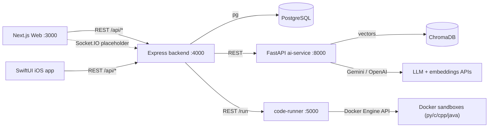
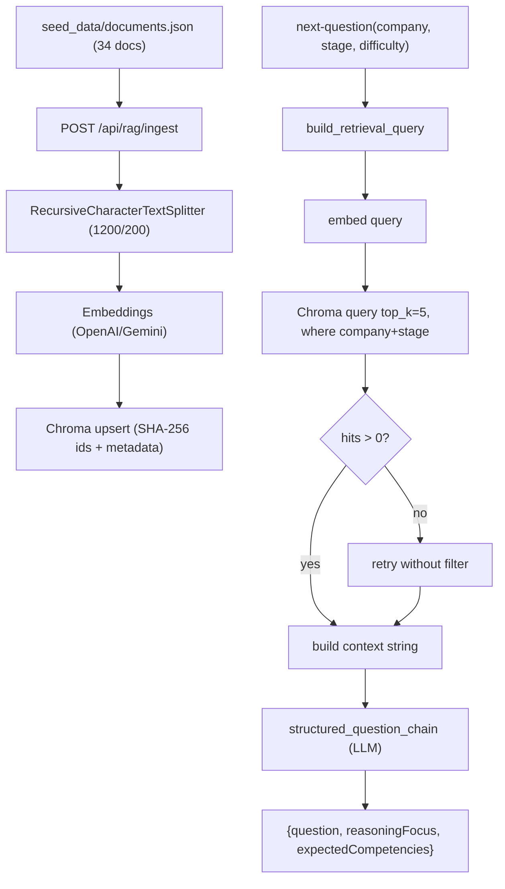

# InterviewForge - Interview Prep Notes

> Your complete, explain-out-loud study guide for the InterviewForge project.
> Read top to bottom once, then jump to whatever the interviewer drills into.
> Everything here is grounded in the actual code, with file paths so you can back up any claim.

---

## Table of Contents

1. [The pitch (30s / 2min)](#1-the-pitch)
2. [High-level architecture](#2-high-level-architecture)
3. [Tech stack and why](#3-tech-stack-and-why)
4. [Service-by-service deep dive](#4-service-by-service-deep-dive)
5. [The RAG pipeline (deep section)](#5-the-rag-pipeline-deep-section)
6. [End-to-end data flows](#6-end-to-end-data-flows)
7. [LLM orchestration details](#7-llm-orchestration-details)
8. [Database schema](#8-database-schema)
9. [AWS deployment](#9-aws-deployment)
10. [Improvements / what I'd do differently](#10-improvements--what-id-do-differently)
11. [One-line cheat sheet](#11-one-line-cheat-sheet)

---

## 1. The pitch

### 30-second version
"InterviewForge is an AI-powered mock interview platform. You pick a company - Amazon, Google, Meta, or Apple - and a difficulty, and it runs you through a full technical loop: behavioral, coding, system design, and core CS. The interview questions aren't just prompted from the LLM - they're grounded with **RAG (Retrieval-Augmented Generation)** over a knowledge base of company-specific interview patterns. There's also a LeetCode-style coding engine where your code runs in **isolated Docker sandboxes**, plus voice answer evaluation, system-design diagram generation, analytics, and learning paths. It's a **microservice architecture** - Node/Express for orchestration and auth, Python/FastAPI for all the AI - and it's **deployed on AWS** (EC2 + RDS + Nginx). There's a Next.js web app and a native SwiftUI iOS app on the same backend."

### 2-minute version (add this)
- **Why I built it this way:** I wanted clean separation of concerns. The Node backend never contains AI logic - it only does auth, sessions, orchestration, and talking to other services over REST. All the ML/LLM/RAG work lives in the Python FastAPI service. That keeps each service small, independently deployable, and lets me use the best ecosystem for each job (LangChain + Chroma in Python, Express + pg in Node).
- **The RAG part is the core differentiator.** A naive version just asks the LLM "give me an Amazon system design question." Mine first retrieves the most relevant chunks from a curated corpus of interview guides (filtered by company + stage), then feeds that as context to the LLM, so the question is calibrated to how that company actually interviews, at the right difficulty band.
- **Safety:** user-submitted code is never run on the host - it runs in ephemeral, network-disabled, memory-capped Docker containers that get destroyed after each run.
- **Production:** It's containerized with Docker Compose (6 services) and deployed on AWS Free Tier - EC2 t3.micro running the app stack behind an Nginx reverse proxy, with PostgreSQL on RDS in a private subnet.

---

## 2. High-level architecture

Six containerized services + two clients (web + iOS).



### The services
| Service | Tech | Port | Responsibility |
|---|---|---|---|
| **web** | Next.js 16, React 19, TS | 3000 | UI: Monaco editor, React Flow diagrams, Recharts, interview UI, PDF export |
| **backend** | Express 5, TS | 4000 | Auth, sessions, orchestration, DB access; calls ai-service + code-runner |
| **ai-service** | FastAPI, Python | 8000 | RAG, all LLM chains, speech, system-design analysis, code review, recs |
| **code-runner** | Node + dockerode | 5000 (5050 host in dev) | Spins up sandbox containers to run user code |
| **postgres** | PostgreSQL 16 | 5432 | All relational data (users, problems, submissions, interviews...) |
| **chromadb** | Chroma 0.5.5 | 8000 (8001 host) | Vector store for RAG embeddings |

### The key design rule (say this verbatim)
> "Node does orchestration and data. Python does AI. They talk over REST. The Node service has **zero** ML logic - if an answer needs to be evaluated or a question generated, Node makes an HTTP call to FastAPI."

This is the central architectural decision and the whole repo is organized around it.

---

## 3. Tech stack and why

- **Next.js (App Router) + React + Tailwind** - SSR-capable, file-based routing, fast to build a polished UI. Monaco editor (same engine as VS Code) for coding, React Flow for architecture diagrams, Recharts for analytics.
- **Express 5 + TypeScript** - lightweight, well-understood orchestration layer. TS for type safety across the API.
- **FastAPI** - async Python framework, auto-generated OpenAPI docs, perfect home for the AI ecosystem (LangChain, Chroma clients, OpenAI/Gemini SDKs).
- **LangChain** - gives a clean abstraction for prompt templates + output parsers + provider swapping, instead of hand-rolling every LLM call.
- **ChromaDB** - simple, open-source vector DB. Runs as its own container, talks HTTP. Good enough for this scale and free.
- **PostgreSQL** - relational data with strong constraints (FKs, unique indexes, JSONB where I need flexibility).
- **Docker + Docker Compose** - every service containerized, one command to bring the whole stack up; same images promoted to production.
- **Gemini 2.5 Flash primary / GPT-4o-mini fallback** - Gemini is cheap/fast for the primary path; OpenAI is the automatic fallback when Gemini is rate-limited, and OpenAI also powers Whisper for speech.

---

## 4. Service-by-service deep dive

### 4.1 Web (Next.js)
- App Router under `web/src/app/` with pages for dashboard, problems, problem detail, interview, system-design, assessments, learning paths (`paths`), leaderboard, analytics, profile, auth (login/register/verify-email/forgot/reset), settings.
- **Monaco editor** for the coding workspace (run/submit, resizable console).
- **React Flow (`@xyflow/react`)** renders system-design diagrams from the AI's nodes/edges JSON - used in `web/src/app/system-design/page.tsx`.
- **PDF export** of the interview report is client-side via jsPDF in `web/src/lib/interviewPdf.ts`.
- **Recharts** for analytics (solved-over-time, difficulty pie, topic radar).
- **Socket.IO client** wired up, but realtime is currently a placeholder (see backend note).

### 4.2 Express backend
Entry point `backend/src/index.ts` (port 4000). Middleware order: `dotenv` -> CORS (single origin = `FRONTEND_URL`, credentials on) -> `express.json()` -> **rate limiting** (`express-rate-limit`, 500 req / 15 min on all `/api/*`). HTTP server is wrapped so **Socket.IO** shares the port (currently only emits a `hello` on connect - scaffolding for future live interviews).

Routes mounted:
- `/api/auth` - register, login, forgot-password, reset-password, verify-email.
- `/api/users` - profile, change-password, avatar, stats, activity (heatmap + streaks), analytics, public `/:username`.
- `/api/problems` - list (filters: difficulty/topic/search/solved) and detail; optional auth for solved/bookmark flags.
- `/api/problem-bookmarks` - add/remove/list bookmarks.
- `/api/submissions` - run/submit code; submission history; **AI code review** at `POST /:id/review`.
- `/api/interviews` - create session, get session+messages, submit answer, get report, plus speech + system-design proxies.
- `/api/assessments` - timed OA: create, get (with `remainingMs`), link submission, finalize+score.
- `/api/leaderboard` - global ranking by distinct problems solved.
- `/api/learning-paths` - list, detail, mark complete.
- `/api/recommendations` - AI topic recommendations + problem suggestions.

**Auth:** JWT (`jsonwebtoken`, HS256, 7-day expiry, payload `{ userId }`), passwords hashed with **bcrypt (10 rounds)**. Middleware `requireAuth` (401 on bad/missing token, sets `req.user`) and `optionalAuth`. Email verification and password reset use random hex tokens with expiry, but emails are only logged to console (no SMTP wired up - good honest talking point).

**External calls:** uses native `fetch` (no axios). AI client wrapper in `backend/src/services/ai.service.ts` (`AI_SERVICE_URL`, default `http://ai-service:8000`); code-runner via `CODE_RUNNER_URL` (`http://code-runner:5000`). DB access through a single `query()` helper over a `pg` Pool in `backend/src/db.ts` - route handlers write SQL directly (thin architecture, no ORM/repository layer).

### 4.3 FastAPI ai-service
Entry `ai-service/app/main.py`. Routers: `rag`, `interview`, `speech`, `system_design`, `code_review`, `recommendations`, plus `/health`.

Endpoints:
- **RAG** (`/api/rag`): `POST /ingest` (chunk + embed + upsert), `POST /query` (retrieve + optionally answer).
- **Interview** (`/api/interview`): `next-question`, `evaluate-answer`, `generate-followup`, `generate-report` (the company-aware structured flow), plus simpler `generate-question`/`evaluate`/`followup`.
- **Speech** (`/api/speech`): `transcribe` (Whisper), `evaluate-explanation` (transcribe + rubric).
- **System design** (`/api/system-design/analyze`): turns an explanation into `{ summary, nodes, edges, risks, improvements, rubric }`.
- **Code review** (`/api/code-review/review`): complexity + quality + optimizations.
- **Recommendations** (`/api/recommendations/recommend`): next topics to study.

All LLM calls go through LangChain chains in `ai-service/app/llm/chains.py` with **structured JSON output** parsed into Pydantic schemas, and a **provider fallback** wrapper (Gemini -> OpenAI). More in [section 7](#7-llm-orchestration-details).

### 4.4 code-runner (the sandbox)
Node + Express (`code-runner/src/index.ts`, port 5000) talking to Docker via **dockerode** (`new Docker({ socketPath: "/var/run/docker.sock" })`). One endpoint: `POST /run` with `{ language, code, testCases, slug }`.

Pipeline (`code-runner/src/runner.ts`):
1. Look up problem metadata by `slug` (method name, arg types, etc.). No metadata -> all cases fail with a clear error.
2. Generate combined code = language harness + user code (`harness-gen.ts`). The harness reads inputs, calls the user's `Solution` method, and prints **one output line per test case**.
3. Build `input.txt` - Python gets one JSON object per line; C/C++/Java get line-per-arg with `---` separators.
4. Pack code file + `input.txt` into an in-memory **tar buffer** (no host temp files) and `putArchive` into the container.
5. Create + start an ephemeral container, run compile+execute as a single `sh -c` command with stdin redirected from `input.txt` and `2>&1`.
6. Enforce a **15s wall-clock timeout** via `Promise.race([container.wait(), timeout])`; on timeout `container.kill()` and return TLE for all cases.
7. Read + demux Docker's multiplexed logs, split into lines, compare each line to expected output (`compareOutputs` - exact match, JSON-aware, float tolerance 1e-4, optional unordered-array compare).
8. `finally`: `container.remove({ force: true })` - always cleaned up.

Security flags actually set: `NetworkDisabled: true`, `Memory` and `MemorySwap` = **256 MiB**. Returns `{ passed, results[], runtimeMs }`. (`runtimeMs` is wall-clock for the whole batch; `memoryKb` is not measured.)

**Ephemeral containers solve the concurrency problem.** Every `POST /run` creates its *own brand-new container* and tears it down in `finally`. This is deliberate: if I had reused one long-lived sandbox container (or written code/input to a shared host path) for all executions, two users submitting at the same time would race on the same files - one request's `solution`/`input.txt`/compiled binary could overwrite another's mid-run, outputs would interleave, and state could leak between runs. By giving each request its own isolated container filesystem and process namespace - with code + `input.txt` injected as an in-memory tar via `putArchive` (no host temp files) - concurrent submissions are fully isolated and can't clobber each other. Even though the compiled binary path (`/tmp/sol`) is the same string, it lives inside a different container per request. Disposable containers also mean no cleanup debt and no cross-run contamination. The trade-off is container start-up cost per run, which is the thing I'd later amortize with a pooled/queued worker model.

Per-language images (built from `docker/sandboxes/*`):
- python -> `python:3.11-slim`, run `python3 -u run.py`.
- c -> `gcc:12-bookworm`, `gcc -O2 -w ... -lm`.
- cpp -> `gcc:12-bookworm` + g++, `g++ -std=c++17 -O2 -w`.
- java -> `eclipse-temurin:17-jdk`, `javac` then `java Main`.

> Honest caveat to mention proactively if asked about hardening: the Dockerfiles define a non-root `runner` user, but the runtime currently overrides with `User: "root"`, and there's no `CapDrop`, `no-new-privileges`, read-only rootfs, `PidsLimit`, or CPU quota yet. I know exactly how I'd close those gaps (see [section 10](#10-improvements--what-id-do-differently)).

### 4.5 ChromaDB
Runs as its own container. The ai-service connects with `chromadb.HttpClient(host, port)` and uses a single collection (`interviewforge_docs`) via `get_or_create_collection` (`ai-service/app/rag/chroma_client.py`).

### 4.6 iOS app
Native SwiftUI (iOS 17+), MVVM, async/await `URLSession` networking, JWT stored in **Keychain**, CodeMirror editor via WKWebView with a Swift<->JS bridge, AVFoundation voice recording, Swift Charts analytics, vis.js diagram rendering. Same Express + FastAPI backend as web.

---

## 5. The RAG pipeline (deep section)

This is the part they liked on your resume, so know it cold. RAG = **Retrieve relevant context first, then Augment the LLM prompt with it, then Generate**. It makes the question realistic and grounded instead of generic.

### 5.1 The corpus
`ai-service/seed_data/documents.json` - **34 curated documents**: company-specific interview guides (Amazon/Google/Meta/Apple x behavioral/coding/system_design) plus general docs (distributed systems fundamentals, core CS). Each doc is:
```json
{ "source": "amazon_behavioral",
  "text": "Amazon Leadership Principles Interview Guide...",
  "metadata": { "company": "amazon", "stage": "behavioral", "type": "interview_guide" } }
```
Seeded by `ai-service/scripts/seed_rag.py`, which POSTs the docs to `/api/rag/ingest`.

### 5.2 Chunking - `RecursiveCharacterTextSplitter`
File: `ai-service/app/rag/chunking.py`. I use LangChain's `RecursiveCharacterTextSplitter`:
```python
RecursiveCharacterTextSplitter(
    chunk_size=1200,        # CHUNK_SIZE_CHARS
    chunk_overlap=200,      # CHUNK_OVERLAP_CHARS
    separators=["\n\n", "\n", ". ", ", ", " ", ""],
    length_function=len,
)
```
**Why recursive splitting (vs fixed-size):** it tries to split on the most semantically meaningful boundary first - paragraph breaks (`\n\n`), then single newlines, then sentence ends (`. `), then clauses (`, `), then words (` `), and only as a last resort mid-word (`""`). That keeps each chunk coherent instead of slicing a sentence in half at character 1200.

**Why `chunk_size=1200` chars:** big enough to hold a self-contained idea (a "key evaluation criteria" block), small enough to keep retrieval precise and stay well within embedding limits. Roughly ~300 tokens.

**Why `overlap=200`:** consecutive chunks share 200 characters so an idea that straddles a boundary isn't lost - whichever chunk gets retrieved still has the full context. This protects against "context fragmentation."

Talking point: "Fixed-size chunking is naive because it cuts mid-sentence. Recursive character splitting respects natural language structure, and the overlap is a safety net for boundary-straddling content."

### 5.3 Embeddings
File: `ai-service/app/rag/embeddings.py`. A provider-abstraction `EmbeddingService.embed(texts)`:
- **OpenAI** `text-embedding-3-small` (batch - send all texts in one request), or
- **Gemini** `text-embedding-004` (per-text loop).
- `EMBEDDING_PROVIDER` env decides which; falls back to whichever key exists.

An embedding turns text into a dense vector (a point in high-dimensional space) where semantically similar text lands close together. That's what makes "find the most relevant chunk" a nearest-neighbor search.

### 5.4 Storage in Chroma (idempotent upsert)
File: `ai-service/app/rag/service.py`, `ingest_documents`:
- For each doc, chunk it, then for each chunk build a **deterministic ID** = `sha256("{source}::{idx}::{chunk_text}")`.
- Attach metadata `{ source, chunk_index, ...doc.metadata }` (so `company`, `stage`, `type` ride along).
- `collection.upsert(ids, documents, embeddings, metadatas)`.

**Why SHA-256 deterministic IDs:** re-running the seed doesn't create duplicates - same content -> same ID -> upsert overwrites instead of inserting again. Idempotent ingestion. Good answer to "how do you avoid duplicate vectors?"

### 5.5 Retrieval (with metadata filtering + graceful fallback)
File: `ai-service/app/rag/service.py`, `retrieve`:
```python
qvec = self.embedder.embed([query])[0]
result = self.collection.query(
    query_embeddings=[qvec],
    n_results=top_k,           # default RAG_TOP_K = 5
    include=["documents", "metadatas", "distances"],
    where=where,               # metadata filter
)
```
- Embed the query the same way as the docs, then Chroma does the nearest-neighbor search and returns top_k hits with distances.
- **Metadata filtering** is the company-specific magic. In `ai-service/app/interview/orchestrator.py`, `retrieve_company_context` filters:
  ```python
  where = {"$and": [{"company": {"$eq": company}}, {"stage": {"$eq": stage}}]}
  ```
  So for an Amazon behavioral question, we only consider Amazon behavioral chunks.
- **Graceful fallback:** if the filtered query returns zero hits, it re-queries without the filter so the LLM still gets *some* grounding rather than nothing.

### 5.6 Query construction
Also `orchestrator.py`, `build_retrieval_query` - builds a rich natural-language query from the company profile, the stage's topic, the difficulty calibration text, the company's focus areas, and even the candidate's previous answer (for follow-ups):
```
"Amazon behavioral interview. Topic: ownership and customer obsession stories.
 Difficulty: medium. Focus areas: ownership, customer obsession, trade-offs, scalability.
 Calibration: SDE-II level... Candidate previously said: <prev answer>"
```
The company profiles live in `ai-service/app/interview/company_profiles.py` - per company: `style`, `focus_areas`, `stage_topics`, and per-difficulty `difficulty_calibration` (easy/medium/hard mapped to real level bars like L3/L4/L5, SDE/SDE-II, E3/E4/E5).

### 5.7 Augment + Generate
- The retrieved chunks are concatenated into a context string (`build_context_from_hits`, joined with `---`).
- That context, plus company, style, stage, difficulty, and calibration, is fed to `structured_question_chain` (`ai-service/app/llm/chains.py`), which returns JSON: `{ question, reasoningFocus, expectedCompetencies }`.

### 5.8 Full RAG flow diagram


---

## 6. End-to-end data flows

### 6.1 Auth
Client -> `POST /api/auth/register|login` -> Express bcrypt-hashes/verifies -> signs JWT `{ userId }` (7d) -> client stores token (Keychain on iOS) -> sends `Authorization: Bearer <token>` -> `requireAuth` verifies on protected routes.

### 6.2 Coding run/submit
```mermaid
sequenceDiagram
  participant U as Web (Monaco)
  participant B as Express
  participant R as code-runner
  participant D as Docker sandbox
  U->>B: POST /api/submissions {problemId, language, code, mode}
  B->>B: load problem + test cases (pg)
  B->>R: POST /run {language, code, testCases, slug}
  R->>D: create container (network off, 256MB), putArchive, start
  D-->>R: stdout (one line per test)
  R->>R: 15s TLE race; compare outputs
  R-->>B: {passed, results[], runtimeMs}
  B->>B: (submit) insert submission row; update path progress
  B-->>U: results
```
`run` = first 4 test cases, no DB write. `submit` = full suite, inserts a `submissions` row (`passed`/`failed`), and on pass updates `user_path_progress`.

### 6.3 AI interview (the headline flow)
Stages in order: **behavioral -> coding -> system_design -> core_cs -> report**. Logic in `backend/src/routes/interviews.routes.ts` + `interview-state.service.ts`.
1. `POST /api/interviews {company, difficulty}` -> backend calls AI `next-question` (behavioral) -> stores session (`status: active`) + opening question as an assistant `interview_messages` row.
2. `POST /api/interviews/:id/answer` -> backend calls AI `evaluate-answer`. Then:
   - If `stage_turn_count < 1` AND `evaluation.shouldAskFollowup` -> call `generate-followup`, store it, increment turn count -> `action: "followup"` (max one follow-up per stage).
   - Else if last stage (core_cs) -> set stage `report`, `status: completed` -> `action: "completed"`.
   - Else -> call `next-question` for next stage (passing previous answer), reset turn count, advance stage -> `action: "advance_stage"`.
3. `GET /api/interviews/:id/report` (must be completed) -> backend builds the full conversation string -> AI `generate-report` -> returns `{ overallScore, stageScores, strengths, weaknesses, recommendations }` and persists scores into the `scores` table.
4. Web turns that report into a downloadable **PDF** client-side (`web/src/lib/interviewPdf.ts`).

Each message is an `interview_messages` row with `role` (assistant/candidate/system), `stage`, `content`, and `metadata_json` (kind = question/answer/evaluation/followup).

### 6.4 Voice explanation
Client records audio -> base64 -> `POST /api/interviews/speech/evaluate-explanation` -> backend proxies to AI -> AI **Whisper (`whisper-1`)** transcribes -> `voice_explanation_rubric_chain` scores technicalCorrectness / communicationClarity / completeness -> returns transcript + rubric.

### 6.5 System design
Client sends `{ prompt, explanation, company? }` -> AI `system_design_analysis_chain` extracts architecture -> returns `nodes`, `edges`, `risks`, `improvements`, and a 5-key `rubric` (requirements, scalability, reliability, data_modeling, communication) -> web renders nodes/edges with **React Flow**.

### 6.6 Code review + recommendations
- Code review: `POST /api/submissions/:id/review` -> AI `code_review_chain` -> `{ timeComplexity, spaceComplexity, qualityScore, strengths, issues, optimizations, summary }`.
- Recommendations: `GET /api/recommendations` -> backend aggregates solve stats / weak topics -> AI `recommendation_chain` -> topics + focus areas + difficulty suggestion + concrete problems.

---

## 7. LLM orchestration details

File: `ai-service/app/llm/chains.py`.

### Provider fallback (Gemini -> OpenAI)
- `LLM_PROVIDER_ORDER` (default `gemini,openai`). `invoke_with_fallback(chain_factory, payload)` tries providers in order.
- On a rate-limit/quota error (`429`, `quota`, `resourceexhausted`, "rate limit"), it sets a **cooldown** for that provider (`_provider_cooldowns`, parsed from the error's "retry in N" hint, default 60s) and moves to the next provider.
- `_available_providers()` skips providers still in cooldown, so subsequent requests go straight to the healthy one. Non-rate-limit errors raise immediately.

This is the resilience story: "If Gemini is rate-limited, the system automatically fails over to OpenAI and remembers to back off Gemini for the cooldown window."

### Structured output via Pydantic + JsonOutputParser
Every important chain uses `JsonOutputParser(pydantic_object=...)` and injects `{format_instructions}` into the prompt, so the LLM must return JSON matching a schema (e.g. `StructuredQuestionOutput`, `StructuredEvaluationOutput`, `InterviewReportOutput`, `SystemDesignAnalysisOutput`, `CodeReviewOutput`, `VoiceRubricOutput`, `RecommendationOutput`). Why it matters: the frontend gets reliable, typed JSON instead of free text it would have to parse - far fewer "the model returned prose" bugs.

Chains are built with LangChain Expression Language: `prompt | _get_llm(provider) | parser`.

---

## 8. Database schema

PostgreSQL, 10 raw SQL migrations in `backend/sql_migrations/` (`pgcrypto` for `gen_random_uuid()`). Tables:
- **users** (001, +004 username, +007 email_verified/verification+reset tokens, +009 avatar_url) - id, email, username, password_hash, name, avatar_url, timestamps.
- **problems** (001, +002 test_cases JSONB, +005 starter_code JSONB, +008 hints/editorial/topics[]/companies[]) - id, slug, title, description, difficulty, plus those.
- **submissions** (001) - user_id, problem_id, language, code, status, runtime_ms, memory_kb, created_at.
- **scores** (001) - user_id, category, score, max_score (used for interview stage scores).
- **interview_sessions** + **interview_messages** (003) - session has company, current_stage, status, stage_turn_count; messages have role, stage, content, metadata_json JSONB.
- **assessments** + **assessment_problems** (006) - timed OA with time_limit_minutes, problem_count, difficulty_mix, score; join table links problems + their submission.
- **problem_bookmarks** (008) - unique(user_id, problem_id).
- **learning_paths** + **learning_path_problems** + **user_path_progress** (010) - curated ordered sequences and per-user completion.

Note: **streaks are computed at query time** from submission/interview dates (window functions) - there's no streaks table. Good "I avoided premature denormalization" point.

---

## 9. AWS deployment

> Lead with: "Yes, it's deployed on AWS Free Tier." Then the details.

### Infrastructure
- **EC2 `t3.micro`** (1 vCPU, 1 GB RAM + **2 GB swap** to survive builds), Amazon Linux 2023, 30 GB gp3 - runs the whole Docker Compose app stack.
- **RDS `db.t3.micro`**, PostgreSQL 16, 20 GB, in a **private subnet** - security group only allows the EC2 instance to reach the DB.
- **Elastic IP** + **Nginx reverse proxy** on port 80 fronting all public traffic; app container ports are bound to `127.0.0.1` only so nothing else is publicly exposed.

### Production stack (`docker-compose.prod.yml`)
- Each service builds from a multi-stage `Dockerfile.prod` - TS compiled to JS, Next.js pre-built, dev deps stripped, no hot reload.
- **Per-container memory limits**: backend 200m, ai-service 300m, code-runner 150m, web 250m, chromadb 200m (because 1 GB box).
- `restart: unless-stopped` on everything.
- Ports bound to localhost (`127.0.0.1:PORT:PORT`); Nginx terminates public traffic.
- code-runner still mounts the host Docker socket so it can launch sandbox containers.

### Deploy flow
SSH in -> `git pull` -> build the 4 sandbox images -> `docker compose -f docker-compose.prod.yml up -d --build` -> run migrations against RDS -> seed problems + RAG. Update = `git pull` + re-`up --build`.

### Honest gaps (roadmap)
HTTPS via Let's Encrypt (needs a domain), CI/CD pipeline, horizontal scaling for code-runner/ai-service - all on the roadmap.

---

## 10. Improvements / what I'd do differently

Frame this as: "It works end-to-end and is deployed, but here's where I'd take it next - I'm aware of the gaps."

### RAG quality (the headline improvements)
- **Reranking** - today retrieval is pure vector top-k. I'd retrieve a wider candidate set (say top 20), then rerank with a **cross-encoder** (e.g. `bge-reranker`) or a hosted reranker (Cohere Rerank), and keep the best 5. Cross-encoders judge query-document relevance jointly, so they're far more precise than the bi-encoder similarity used for first-stage retrieval. This is the single biggest quality win.
- **Hybrid search** - combine dense vector search with sparse keyword search (BM25) and fuse with **Reciprocal Rank Fusion (RRF)**. Dense search misses exact-term matches (specific algorithm names, acronyms); hybrid fixes recall on rare terms.
- **Query expansion / HyDE** - generate a hypothetical answer or paraphrases and embed those to improve recall for short/ambiguous queries.
- **MMR (Maximal Marginal Relevance)** - diversify retrieved chunks so I'm not feeding the LLM five near-duplicate passages.
- **Smarter chunking** - markdown/semantic-aware splitting and **parent-document retrieval** (embed small chunks for precision, return the larger parent for context). Richer metadata (difficulty, topic tags) for finer filtering.
- **A real corpus + RAG evaluation** - the current corpus is 34 hand-written guides. I'd ingest real engineering blogs / interview-experience posts, and add a **RAGAS**-style eval harness (context precision/recall, faithfulness, answer relevance) with a golden test set so I can measure retrieval changes instead of eyeballing them.
- **Embedding upgrades + caching** - cache embeddings for repeated queries; benchmark larger embedding models; consider per-tenant collections.

### AI infra
- **Streaming responses** (SSE) so questions/evaluations stream token-by-token - much better perceived latency.
- **Self-host Whisper** (faster-whisper) to remove the hard OpenAI dependency for speech and cut cost.
- **Observability** - tracing with LangSmith/Langfuse, structured logs, token/cost metrics, latency dashboards.
- **Prompt/version management** and offline regression tests for prompts.

### Code-runner hardening + scale
- Drop the `User: root` override (run as the `runner` user the images already define), `CapDrop: ["ALL"]`, `SecurityOpt: ["no-new-privileges"]`, `ReadonlyRootfs`, `PidsLimit` (stop fork bombs), and CPU quota (`NanoCpus`).
- Stronger isolation with **gVisor (runsc)** or **Firecracker microVMs**.
- A job **queue + worker pool** and horizontal scaling so concurrent submissions don't contend; per-user rate limits/quotas.
- Actually measure memory (cgroup stats) and report real MLE instead of leaving `memoryKb` null.

### Platform / production
- **CI/CD** (lint, typecheck, test, build, deploy) - currently manual `git pull` + rebuild.
- **HTTPS** via Let's Encrypt + a domain.
- **Secrets manager** (AWS Secrets Manager / SSM) instead of per-service `.env` files (which are gitignored, not committed) for centralized rotation and access control.
- **Redis** caching layer (sessions, leaderboard, hot problems) and to back rate limiting across instances.
- **Real email delivery** (SES) for verification/reset - currently logged to console.
- **Finish realtime** - Socket.IO is scaffolded; use it for live interview streaming and collaborative mock interviews.
- **Autoscaling / move off a single t3.micro**, managed Chroma or pgvector, and DB read replicas as load grows.
- **Testing** - more integration tests across the service boundaries.

### Things I'd reconsider architecturally
- Add a thin **repository/service layer** in the backend (routes currently hold SQL + business logic directly).
- Consider **pgvector** instead of a separate Chroma container to reduce moving parts (one less service, transactional with the rest of the data).

---

## 11. One-line cheat sheet

- **What:** AI mock-interview platform (coding + behavioral + system design + core CS), web + iOS.
- **Architecture:** 6 Docker services; Node/Express = orchestration+auth, Python/FastAPI = all AI; PostgreSQL + ChromaDB.
- **RAG:** 34-doc corpus -> RecursiveCharacterTextSplitter (1200/200) -> OpenAI/Gemini embeddings -> Chroma upsert with SHA-256 ids + metadata -> top-k=5 retrieval filtered by company+stage -> LLM structured JSON question.
- **LLM:** Gemini primary, OpenAI fallback with cooldowns; LangChain chains with Pydantic JSON output.
- **Code execution:** ephemeral Docker sandboxes, network off, 256 MB, 15s timeout, auto-removed.
- **Deployed:** AWS - EC2 t3.micro + Nginx, RDS PostgreSQL in private subnet, prod compose with memory limits.
- **Next:** reranking + hybrid search + RAG eval, sandbox hardening (gVisor), streaming, CI/CD, HTTPS, Redis.
